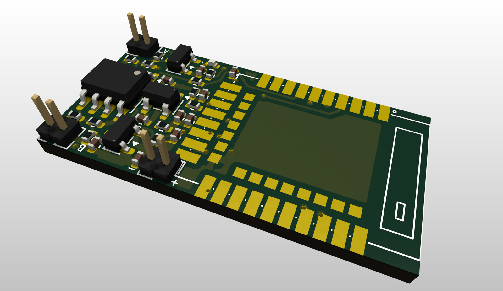

# Portfolio

# Education

### New York University Abu Dhabi

- B.S. Computer Engineering (*May 2028*)

# Work Experience

### Undergraduate Researcher @ Spacecraft Prototyping Laboratory (SPL), KAIST (*June 2026 - August 2026*)

**Free-Space Optical Communication, Closed-Loop Pointing Control, Link Characterization**

- Tested closed-loop control of a fast steering mirror (FSM) for fine beam pointing on the lab's free-space optical (FSO) communication testbed
- Characterized FSO link quality through bench-top SNR measurements on lab hardware and BER performance analysis
- Building attitude-determination foundations — quaternion kinematics and multi-sensor attitude estimation — toward the lab's star tracker and satellite GNC research

### Summer Research Assistant @ Engineering Design Studio (*May 2023 - July 2023*)

- Collaborated with NASA-JPL engineers from Group 355A (Architecture and Formulation Group) to design and deliver a flight-ready Hold-Down-and-Release Mechanism (HDRM)
- Developed embedded flight-control firmware for staged event triggering and actuator command sequencing on an experimental sounding rocket, flight-tested at Spaceport America Cup 2023
- Engineered custom PCBs (power distribution and flight controller) and the corresponding embedded systems

# Projects

### Optical Ground Station (OGS) Live Link Budget Simulator (*2026*)

**FSO Channel Modeling, Pointing-Jitter Statistics, MATLAB GUI** — [Repository📡](https://github.com/reptide/ogs-linkbudget-live)

- Built an interactive MATLAB simulator evaluating link margin and tracking reliability of satellite-ground laser links
- Integrated a live weather API to scale atmospheric attenuation from real-time humidity, cloud cover, and precipitation
- Modeled fine-pointing error as Rayleigh/Rician-distributed jitter to compute time-series link margin, margin probability density, and link outage rate; validated against a SaTReC (KAIST) ground-station scenario

### StringSense — AI Practice-Coaching Pickup (*June 2026 - Present*)
[stringsense.kr🎻](https://stringsense.kr/)

**Analog Front-End Design, Embedded Firmware, PCB Design/Fabrication, Mechanical CAD** — Solo Founder @ KAIST OVERGE Program

- Independently designed a real-time wireless sensing device for bowed string instruments: dual-piezo analog front-end (op-amp buffering, anti-alias filtering), multi-channel ADC acquisition on an nRF52840, and BLE streaming to a phone
- Owned the full sensing chain — sampling and anti-aliasing strategy, low-power wake logic via on-chip analog comparator (LPCOMP), KiCad PCB layout carried through fabrication, and enclosure CAD

### HaloShip (Spaceport America Cup 2023) (*Sep 2022 - June 2023*)

**Embedded Flight Control, Sensor Fusion, Avionics, CAD, Stress/Aero Simulations** [Flight🚀](https://www.youtube.com/live/LpET1HB0Kto?si=ydTEDwBJHsaJpAHa&t=9399)

- Led design of a reusable experimental sounding rocket with modular subassemblies for complete assembly/disassembly
- Implemented a dual-redundant, non-pyrotechnic parachute deployment system with multi-sensor-fusion triggering logic for fail-safe recovery event timing
- Developed custom avionics including a flight computer for real-time sensor data acquisition and a high-speed data acquisition payload

### NASA-JPL University Crowdsourcing Initiative (JUCI) (*Sep 2022 - June 2023*)

**Actuation Mechanism Design, CAD, Stress Simulations**

- Delivered a solenoid/actuator-triggered Hold-Down-and-Release Mechanism (HDRM) for CubeSats and small space missions
- Reduced system costs by 90% (approximately $10,000 > $1,000) while maintaining NASA flight requirements

# Technical Skills

### Control & Estimation:

**Closed-loop pointing control (FSM), state estimation (Kalman filtering, multi-sensor fusion), link analysis (link budget, SNR/BER), MATLAB Simulink & Control System Toolbox**

### Embedded & Real-Time Systems:

**C/C++ firmware, nRF52 (SAADC, BLE, LPCOMP), Arduino, PlatformIO, Raspberry Pi, real-time data acquisition**

### PCB & CAD:

**KiCad, Altium Designer, Onshape, SolidWorks, Fusion360, AutoCAD, SimScale, OpenRocket**

### Languages & Environments:

**Python, MATLAB, C++, C#, Java, LaTeX, Git, VS Code, Xcode, GCP, Overleaf**